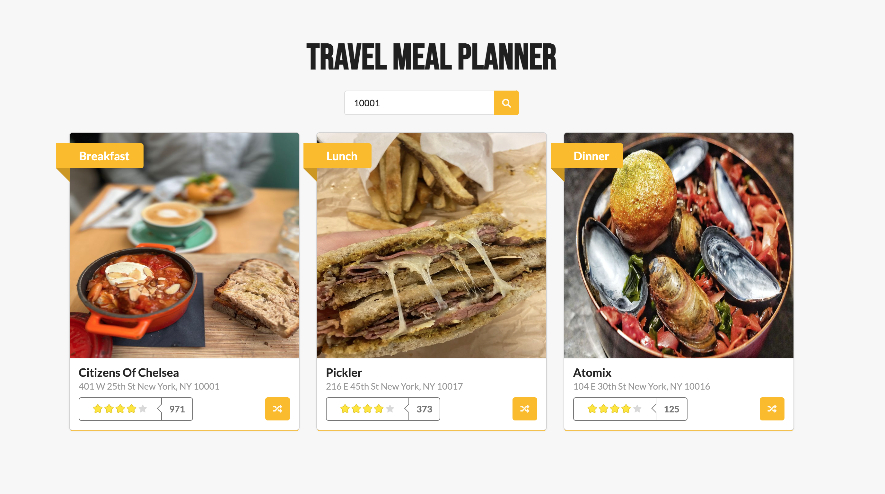

<div align="center">
  <h1>Travel Meal Planner</h1>  
</div>

<p align="center">
  
  
  <a href="https://github.com/401unauthorized/travel-meal-planners#readme" target="_blank">
    
  </a>
  <a href="https://github.com/401unauthorized/travel-meal-planner/graphs/commit-activity" target="_blank">
    
  </a>
  <a href="https://github.com/401unauthorized/travel-meal-planner/blob/master/LICENSE.md" target="_blank">
    
  </a>
</p>

<div align="center">
  
</div>

## 💾 Installation

```bash
git clone https://github.com/401Unauthorized/travel-meal-planner.git
cd travel-meal-planner
npm install
```


## 🔌 Quick Start

Create a `.env.local` file in the root directory of the project and add the following:

```BASH
YELP_KEY=abc123
```
> Note, the YELP_KEY is your private API key provided on the Yelp Developer platform.

Run the development server using the following command:

```bash
npm run dev
```

> Note, a script runs in the background to create a local MongoDB server which stores data in memory to be used by the application server during development. The DB server will automatically be stopped when the application is stopped.

Open [http://localhost:3000](http://localhost:3000) with your browser to see the web page.

## 🔮 Features

This is a full-stack `Next.js` application which uses `React` on the frontend and `Node.js` / `Express` on the backend.

All the code is within the `src` directory.

### Frontend Directories
- components
- pages
- styles

### Backend Directories
- backend
- pages/api/...

[API routes](https://nextjs.org/docs/api-routes/introduction) are accessed on the [http://localhost:3000/api/](http://localhost:3000/api/) path.

The `pages/api` directory is mapped to `/api/*`. Files in this directory are treated as [API routes](https://nextjs.org/docs/api-routes/introduction) instead of `React` components/pages.

For production, [API routes](https://nextjs.org/docs/api-routes/introduction) become serverless functions using a `Node.js` runtime and can be deployed to numerous cloud providers.


## 👓 Transparency
- There are very simplified or missing data validation for the API, DB & feature code.
- Due to time constraints, test cases are limited (YelpRestaurants.test.js is the most complete)
- Security considerations have not been implemented (rate limiting, etc)
- This has not been deployed / used in a production environment

## 💡 API Endpoints

#### GET `/api/v1/plan/generate`

Request
```javascript
Query Params
- location: zip code provided by user
```

Response
```javascript
{
  location: 10001,
  lastUpdated: 1675315824,
  breakfast: [{
    id: 'abc123',
    name: 'Citizens Of Chelsea',
    image: 'https://s3-media4.fl.yelpcdn.com/bphoto/zJphDSzG5aYRcqge_PtqJQ/o.jpg',
    link: 'https://www.yelp.com/...',
    ratingCount: 971,
    rating: 4,
    address: '401 W 25th St New York, NY 10001'
  }],
  lunch: [...],
  dinner: [...]
}
```

#### GET `/api/v1/plan/shuffle`

Request
```javascript
Query Params
- location: 'zip code provided by user'
- id: 'the id of the current restaurant'
- type: 'the meal type (ex breakfast)'
```

Response
```javascript
{
  breakfast: {
    id: 'abc123',
    name: 'Citizens Of Chelsea',
    image: 'https://s3-media4.fl.yelpcdn.com/bphoto/zJphDSzG5aYRcqge_PtqJQ/o.jpg',
    link: 'https://www.yelp.com/...',
    ratingCount: 971,
    rating: 4,
    address: '401 W 25th St New York, NY 10001'
  }
}
```

## 👤 Author

 **Stephen Mendez**

- Website: https://www.stephenmendez.dev
- Twitter: [@stephenmendez\_](https://twitter.com/stephenmendez_)
- Github: [@401unauthorized](https://github.com/401unauthorized)

## 📝 License

Copyright © 2023 Stephen Mendez<br />
This project is MIT licensed.
